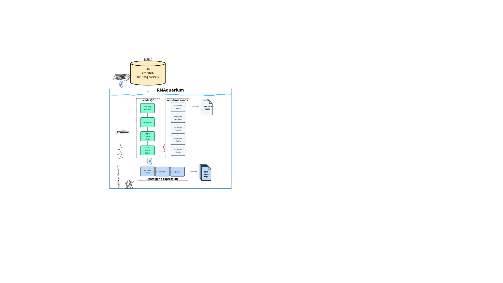

# Zebrafish RNAquarium

## Pre-processing pipeline for all Zebrafish RNAseq datasets in the [NCBI Sequence Read Archive (SRA)](https://www.ncbi.nlm.nih.gov/sra)
Produce the following for each Zebrafish dataset:
- Gene counts table
- Non-zebrafish reads

The RNAquarium pre-processing pipeline filters, by alignment to host genome, the majority of host
reads retrieved.  For Zebrafish, starting from 60,912 runs this means retaining approximately
22 billion out of 1.06 trillion input reads (~2%) as "possible nonhost" - this initial filtering is
necessary to make more computationally expensive downstream searches and taxonomy calling feasible.

## Overview of the workflow

