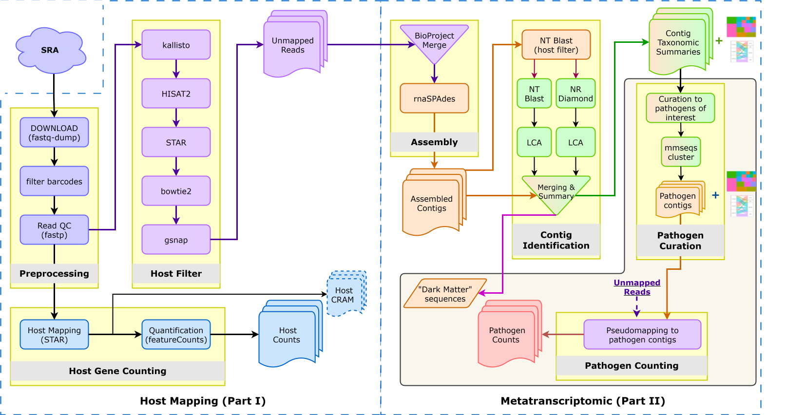

# RNAquarium

## Pre-processing pipeline for Species-scale RNAseq from the [NCBI Sequence Read Archive (SRA)](https://www.ncbi.nlm.nih.gov/sra)
Produce the following for each RNAseq dataset:
- Gene counts table
- Non-zebrafish reads

The RNAquarium pre-processing pipeline filters, by repeated alignment to host genome, the majority of host
reads retrieved.  For Zebrafish, starting from 77,188 runs this means retaining approximately
11 billion out of 1.64 trillion input reads (~0.7%) as unmapped "possible nonhost" - this initial filtering is
necessary to make more computationally expensive downstream searches and taxonomy calling feasible.

## Overview of the workflow

