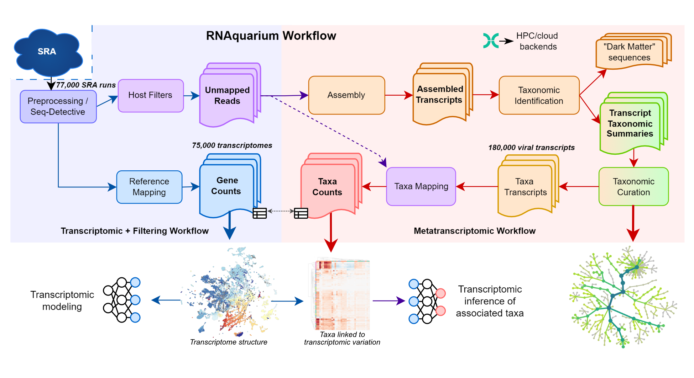

# RNAquarium

## Pre-processing pipeline for Species-scale RNAseq from the [NCBI Sequence Read Archive (SRA)](https://www.ncbi.nlm.nih.gov/sra)

RNAquarium is a [Nextflow](https://www.nextflow.io/) (DSL2) pipeline for reprocessing public RNAseq datasets at species scale. Starting from raw SRA runs, it filters host reads and produces gene counts and non-host reads (Part I), then assembles and taxonomically classifies the remaining non-host content (Part II).

RNAquarium enables:

* Retrieving and quality-filtering RNAseq runs directly from the SRA
* Filtering host reads by repeated alignment to a host genome — for zebrafish, retaining ~0.7% of input reads (~11 billion of 1.64 trillion across 77,188 runs) as "possible nonhost"
* Producing per-dataset gene counts tables
* Assembling and taxonomically classifying non-host reads, including viruses (Part II: metatranscriptomics)

## Overview of the workflow

## Explore the data

Explore, visualize, and interact with RNAquarium project data — including via a chatbot — at the **[RNAquarium Portal](https://portal.rnaquarium.org)**.

## Installation and Usage

Please refer to the [documentation](https://czbiohub-sf.github.io/RNAquarium/) for full installation, parameters, and pipeline reference.

**Part I — Transcriptomic + Filtering**

* [Inputs and Databases](czbiohub-sf.github.io/RNAquarium/inputs-and-databases.html)
* [Non-host pipeline overview](czbiohub-sf.github.io/RNAquarium/nonhost-readme.html)
* [Getting Started (installation & usage)](czbiohub-sf.github.io/RNAquarium/gettingstarted.html)
* [Parameters](czbiohub-sf.github.io/RNAquarium/parameters.html)
* [Pipeline Explanation](czbiohub-sf.github.io/RNAquarium/pipeline-explanation.html)
* [Technical Notes](czbiohub-sf.github.io/RNAquarium/technical-notes.html)

**Part II — Metatranscriptomics**

* [Metatranscriptome pipeline overview (usage)](czbiohub-sf.github.io/RNAquarium/metatranscriptome-readme.html)
* [Metatranscriptome Technical Notes](czbiohub-sf.github.io/RNAquarium/Metatranscriptome-Technical-Notes.html)
* [Metatranscriptome virus-steps Technical Notes](czbiohub-sf.github.io/RNAquarium/Metatranscriptome_virus-steps-Technical-Notes.html)

## Authors and maintainers

RNAquarium is developed and maintained by the [Computational Biology Platform](https://biohub.org/comp-biology/) & [Balla Group](https://biohub.org/balla/) at the [Biohub](https://biohub.org).

* **Research Lead Team:** Keir Balla, Duo Peng, Yasin Şenbabaoğlu
* **Bioinformatics Team:** Yttria Aniseia, Eric Waltari, Max Frank, Gibraan Rahman, Andy Zhou, Yang-Joon Kim, Hejin Huang
* **Web Development Team:** Leandro Lima, Wellington Rutes

## Code of Conduct

This project follows the [Code of Conduct](CODE_OF_CONDUCT.md). By participating, you are expected to uphold it.

## License

RNAquarium is released under the [BSD 3-Clause License](LICENSE). Copyright (c) Chan Zuckerberg Biohub.
